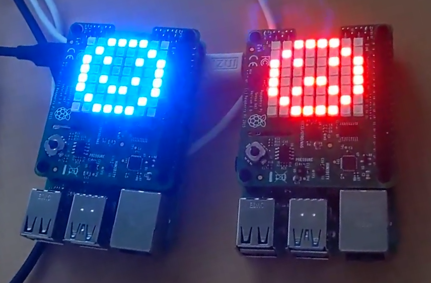
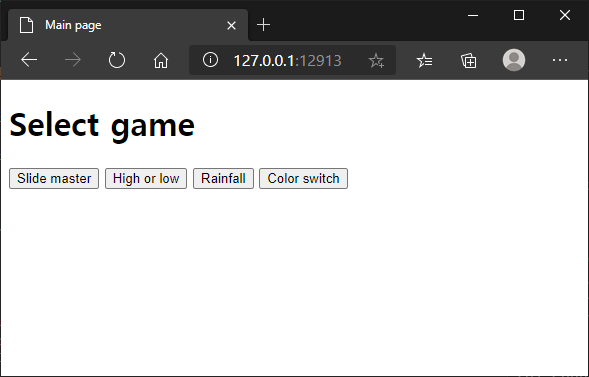
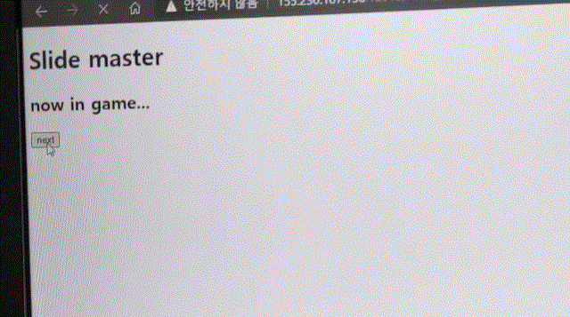
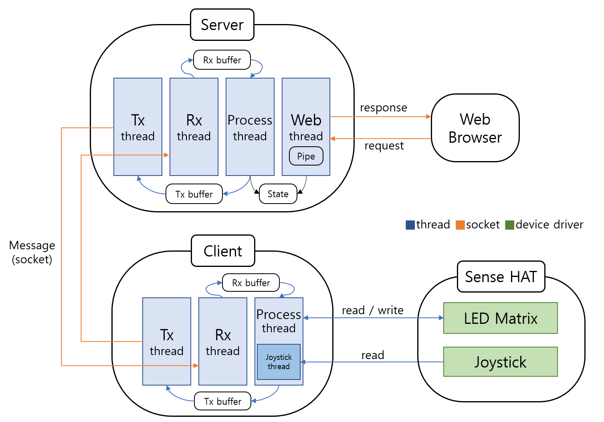
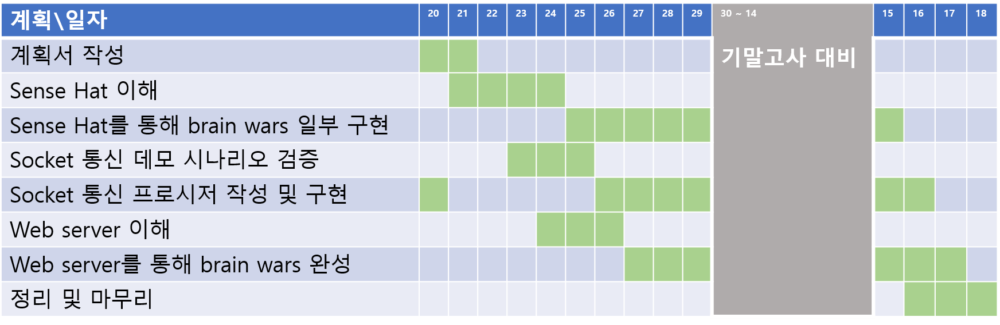
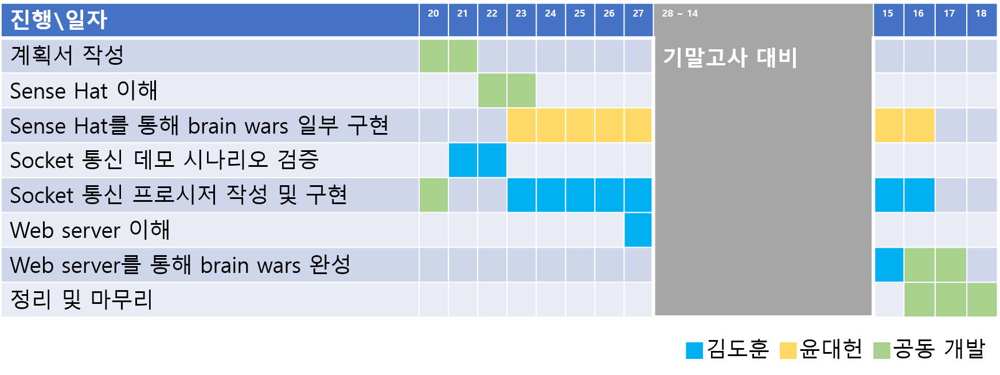

# 임베디드 시스템 프로그래밍 텀 프로젝트 Brainwars



## Introduction

- 실시간 대전형 두뇌 트레이닝 게임
- 간단한 퍼즐을 상대방보다 빠르고 정확하게 풀어야 함
- 상대방보다 더 높은 점수를 얻으면 승리

[텀 프로젝트 계획서](https://github.com/yh08037/brainwars/blob/master/reports/project_plan.pdf)에서 더 구체적인 구현 내용과 게임 종류 및 규칙에 대해 알 수 있음

(계획서와 실제 구현 요소와 다를 수 있음)

[시연영상1](https://youtu.be/J6u8vPuKAPY)

[시연영상2](https://youtu.be/2d-FR6rkFUw)

## Prerequisite
```
gcc version 9.3.0
GNU Make 4.2.1
Raspberry Pi 4
Sense HAT
```
-   Server: ubnutu linux + (apache2 설치되어야 함)
-   Client: raspberry pi + sense hat 2대

모두 인터넷 연결이 되어야 함

## How To Run

-	소스코드: https://github.com/yh08037/brainwars
-	서버 실행: server 폴더에서 make 한 뒤 ./server -p <포트 번호>
```
~$ git clone https://github.com/yh08037/brainwars.git
~$ cd server
~/server$ make
~/server$ ./server -p <port number>
```
-	클라이언트 실행: client 폴더에서 make 한 뒤 ./client -d <서버 주소> -p <포트 번호>
```
~$ git clone https://github.com/yh08037/brainwars.git
~$ cd client
~/client$ make
~/client$ ./client -d <ip address> -p <port number>
```
-	웹 실행: 웹 브라우저 주소창에 <서버 주소>:12913




## How To Play

(웹을 처음 실행할 때 주소를 입력해도 넘어가지 않는 경우 해당 주소를 한 번 더 입력하면 된다.)

(또한, 버튼을 클릭해도 넘어가지 않는 경우 한 번 더 클릭하면 된다.)
-	서버 실행 후, 클라이언트 2개를 실행한다.


-	웹 실행 후, 원하는 게임을 클릭한다.


-	클라이언트에서 빨간색 마이너스(-)가 표시된다. 조이스틱을 입력하여 게임 준비를 알림
-   3, 2, 1이 나오며 게임 시작, 웹 브라우저에서 next를 누른다.


-   게임이 끝나면 점수와 승패 여부가 나오게 되고, 웹 브라우저에서 next를 누르면 게임 결과가 나오게 된다.




-   서버 터미널창에 enter를 누르고 웹 브라우저에서 next를 누른다. 그리고 클라이언트에 각각 조이스틱을 한번씩 눌러주면 다시 게임을 실행할 수 있는 상태가 된다.


## System Overview



## Progress
### 개발 계획 일정


### 개발 일지
[Progress.md](reports/progress.md) 에서 개발 일지 전문을 확인할 수 있다.



## Developer's comment

-   [김도훈](reports/comment_yh08037.md)
-   [윤대헌](reports/comment_greathoney.md)
