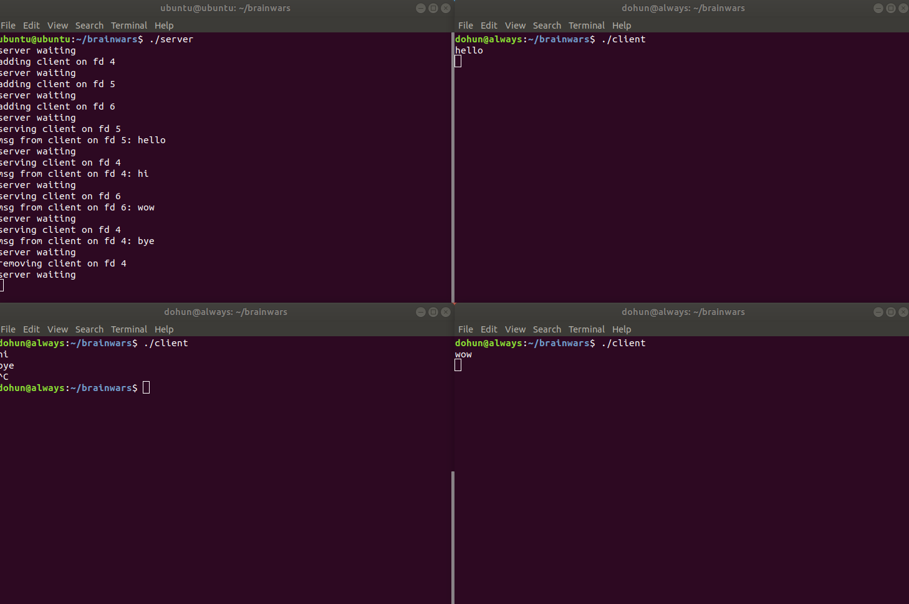
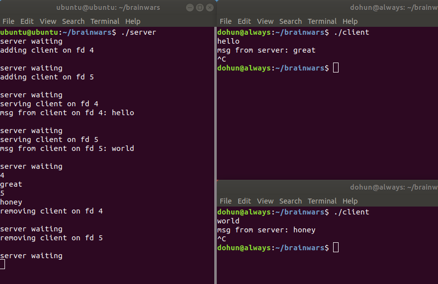
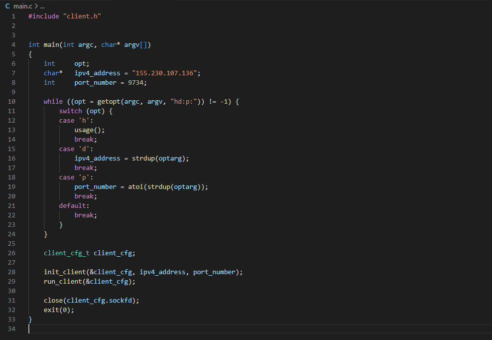
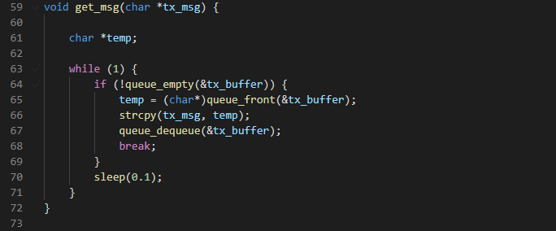

# brainwars

## Introduction

실시간 대전형 두뇌 트레이닝 게임

텀 프로젝트 계획서는 reports에 있습니다.

## Progress

### 2020.11.21
#### client/server - 다중 사용자 접속 가능한 서버 테스트
소켓 통신을 통한 단방향(클라이언트->서버) 문자열 메시지 송수신 구현

### 2020.11.22
#### client/server - 양방향 송수신 구현
쓰레드를 통한 양방향(클라이언트<->서버) 문자열 메시지 송수신 구현

참고: [FD_SET, FD_ZERO등의 매크로 함수 정리](http://blog.naver.com/tipsware/220810795410)

#### LED Matrix 이해 및 응용
LED matrix 이해 및 원하는 원하는 대로 출력
원하는 위치에 원하는 색을 표시할 수 있도록 구현함

### 2020.11.23
#### joystick 이해
joystick의 입력을 받을 수 있는 디바이스 드라이버 구현

#### slide_mater 일부 구현
파란색 화살표면 화살표 반대로 입력, 빨간색 화살표면 반대로 입력
오답시 깜빡깜빡하게 만들었음

#### client/server - main 함수 인터페이스 단순화 
소켓, 쓰레드 설정등의 코드를 init/run 함수로 분리해 main 함수를 읽기 쉽게 함

#### client/server - tx_buffer / process 함수 추가
기존 scanf로 데이터 발생시킨 부분 대신 버퍼에 보낼 데이터가 있는지 확인하여 전송

### 2020.11.24

#### slider master 코드 최적화
코드 블럭화 시켜 코드를 옮기기 편하게 만들었음
