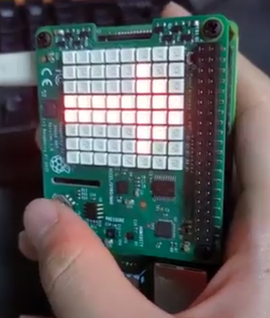
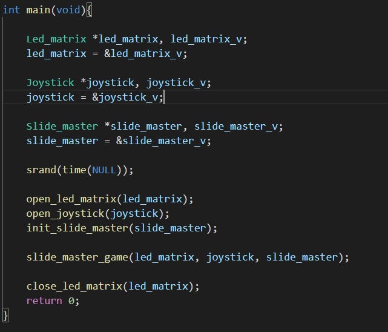

# brainwars

## Introduction

실시간 대전형 두뇌 트레이닝 게임

텀 프로젝트 계획서는 reports에 있습니다.

## Progress

### 2020.11.21
#### client/server - 다중 사용자 접속 가능한 서버 테스트
소켓 통신을 통한 단방향(클라이언트->서버) 문자열 메시지 송수신 구현


### 2020.11.22
#### client/server - 양방향 송수신 구현
쓰레드를 통한 양방향(클라이언트<->서버) 문자열 메시지 송수신 구현

참고: [FD_SET, FD_ZERO등의 매크로 함수 정리](http://blog.naver.com/tipsware/220810795410)


#### LED Matrix 이해 및 응용
LED matrix 이해 및 원하는 원하는 대로 출력

원하는 위치에 원하는 색을 표시할 수 있도록 구현함

### 2020.11.23
#### joystick 이해
joystick의 입력을 받을 수 있는 코드 구현

#### slide_mater 일부 구현
파란색 화살표면 화살표 반대로 입력, 빨간색 화살표면 반대로 입력

오답시 깜빡깜빡하게 만들었음



#### client/server - main 함수 인터페이스 단순화 
소켓, 쓰레드 설정등의 코드를 init/run 함수로 분리해 main 함수를 읽기 쉽게 함


#### client/server - tx_buffer / process 함수 추가
기존 scanf로 데이터 발생시킨 부분 대신 버퍼에 보낼 데이터가 있는지 확인하여 전송


### 2020.11.24

#### slider master 코드 최적화
코드 블럭화 시켜 코드를 옮기기 편하게 만들었음


### 2020.11.25

#### 단일 slider matster 완성
시작하기 전 3초 타이머 구성 - 주변 테두리(링)으로 시각적으로 남은 시간 (ms) 단위만 표현

게임 시작하면 20초 동안 플레이 - 주변 테두리(링)으로 시각적으로 전체 남은 시간 표현

게임 끝나면 점수 표시 후 사라짐

#### 소스 파일들의 위치 변경
`queue.h` `queue.c`의 중복, main 폴더 내의 파일이 너무 많아짐에 따라 main을 제외한 나머지 파일을 src 폴더로 이동

이에 따라 Makfile을 수정하였음
```
brainwars                      brainwars
+---client                     +---src
|   +---client.h               |   +---client.h
|   +---client.c               |   +---client.c
|   +---queue.h                |   +---server.h
|   +---queue.c                |   +---server.c
|   \---main.c       --->      |   +---queue.h
\---server                     |   \---queue.c
    +---server.h               +---client
    +---server.c               |   \---main.c
    +---queue.h                \---server
    +---queue.c                    \---main.c
    \---main.c
```

#### client/server - 메시지 자료형 변경 (문자열->구조체)

``` c
typedef enum _msg_type_t {
	MSG_SELECT = 0,     // server -> client
	MSG_READY,          // client -> server
	MSG_START,          // server -> client
	MSG_FINISH,         // client -> server
	MSG_RESULT          // server -> client
} msg_type_t;

typedef struct _msg_t {
    msg_type_t type;
    int data;
} msg_t;
```
이전까지는 송수신 기능 테스트를 위해 데이터를 문자열로 사용하였음

메시지의 송수신에 대한 기능검증이 완료되었으므로 

brainwars 게임 구동에 필요한 정보를 고려하여 메시지 구조체 타입을 정의함


