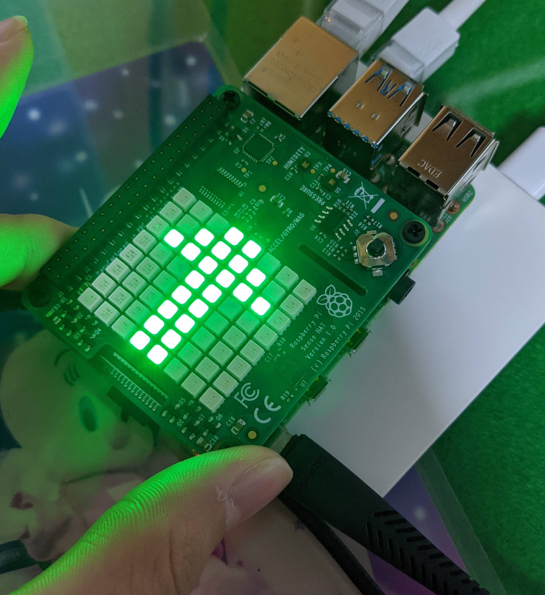
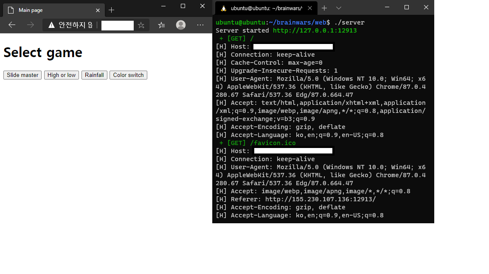

# brainwars

## Introduction

실시간 대전형 두뇌 트레이닝 게임

텀 프로젝트 계획서는 reports에 있습니다.

## Progress

### 2020.11.21
#### client/server - 다중 사용자 접속 가능한 서버 테스트
소켓 통신을 통한 단방향(클라이언트->서버) 문자열 메시지 송수신 구현


### 2020.11.22
#### client/server - 양방향 송수신 구현
쓰레드를 통한 양방향(클라이언트<->서버) 문자열 메시지 송수신 구현

참고: [FD_SET, FD_ZERO등의 매크로 함수 정리](http://blog.naver.com/tipsware/220810795410)


#### LED Matrix 이해 및 응용

LED Matrix 이해 및 LED matrix에 원하는 대로 출력
- 예제를 이해하고, 메모리 주소
- LED Matrix의 메모리 주소에 접근하여 RGB565 포맷에 따라 원하는 위치에 원하는 색을 표시할 수 있음

- 메모리의 주소는 아래와 같음을 확인함


### 2020.11.23
#### joystick 이해 및 설계

joystick의 입력을 받을 수 있는 코드 구현
- python 모듈을 통해 joystick가 어떻게 동작하는지 분석함
- "/dev/input/event0"에 joystick의 입력을 받을 수 있는 파일 디스크립터가 있음을 확인. 즉 joystick은 하나의 키보드처럼 동작함
- 파이썬 sensehat 모듈을 통해 어떤 식으로 입력을 받는지 동작 확인
- c언어로 구현해야 하기 때문에 c언어의 read() 함수를 가져와 조이스틱의 입력 정보를 확인함
- joystick은 스레드로 동작, 전역변수를 통해 메인 스레드와 연결
- 키를 입력했을 때 순간 이벤트를 발생하고, 바로 다음에 빈 이벤트를 발생시킨다.
- 또한 계속 입력했을 때, 키를 놓았을 때 이벤트를 발생하고, 바로 다음에 빈 이벤트를 발생시킨다.
```
pi@raspberrypi:~/brainwars/brainwars/game $ ./test
105
0
105
0
105
0
105
0
105
0
105
0
106
0
106
0
103
```
- 키를 입력했을 때 아래의 정보가 출력된다.


#### slide_mater 일부 구현
파란색 화살표면 화살표 반대로 입력, 빨간색 화살표면 반대로 입력

오답시 깜빡깜빡하게 만들었음


#### client/server - main 함수 인터페이스 단순화 
소켓, 쓰레드 설정등의 코드를 init/run 함수로 분리해 main 함수를 읽기 쉽게 함


#### client/server - tx_buffer / process 함수 추가
기존 scanf로 데이터 발생시킨 부분 대신 버퍼에 보낼 데이터가 있는지 확인하여 전송


### 2020.11.24

#### slider master 코드 최적화
코드 블럭화 시켜 코드를 옮기기 편하게 만들었음 아래 사진은 게임 실행 파일의 main 함수임

추가로 파일 분리도 같이 할 예정


### 2020.11.25

#### 단일 slider matster 완성
시작하기 전 3초 타이머 구성 - 주변 테두리(링)으로 시각적으로 남은 시간 (ms) 단위 표현


게임 시작하면 20초 동안 플레이 - 주변 테두리(링)으로 시각적으로 전체 남은 시간 표현


게임 끝나면 점수 표시 후 사라짐


#### 소스 파일들의 위치 변경
`queue.h` `queue.c`의 중복, main 폴더 내의 파일이 너무 많아짐에 따라 

main을 제외한 나머지 파일을 src 폴더로 이동하였으며 이에 맞게 Makfile을 수정하였음

```
brainwars                      brainwars
+---client                     +---src
|   +---client.h               |   +---client.h
|   +---client.c               |   +---client.c
|   +---queue.h                |   +---server.h
|   +---queue.c                |   +---server.c
|   \---main.c       --->      |   +---queue.h
\---server                     |   \---queue.c
    +---server.h               +---client
    +---server.c               |   \---main.c
    +---queue.h                \---server
    +---queue.c                    \---main.c
    \---main.c
```

#### client/server - 메시지 자료형 변경 (문자열->구조체)

``` c
typedef enum _msg_type_t {
    MSG_SELECT = 0,     // server -> client
    MSG_READY,          // client -> server
    MSG_START,          // server -> client
    MSG_FINISH,         // client -> server
    MSG_RESULT          // server -> client
} msg_type_t;

typedef struct _msg_t {
    msg_type_t type;
    int data;
} msg_t;
```
이전까지는 송수신 기능 테스트를 위해 데이터를 문자열로 사용하였음

메시지의 송수신에 대한 기능검증이 완료되었으므로 

brainwars 게임 구동에 필요한 정보를 고려하여 메시지 구조체 타입을 정의함

### 2020.11.26

슬라이드 마스터 버그 수정 및 완성도 개선

#### client.h와 붙일 준비 완료
``` c
typedef struct _result_t {
    int correct;
    int wrong;
} result_t;

void slide_master_game(result_t *result, led_matrix_t *led_matrix); 
```


#### client/server - process 쓰레드의 상태 천이 절차 로직 구현
``` c
/* in client.h */
typedef enum _client_state_t {
	WF_SELECT = 0,
	IP_READY,
	WF_START,
	IN_GAME,
	WF_RESULT,
	DP_RESULT
} client_state_t;

/* in server.h */
typedef enum _server_state_t {
    WF_USER = 0,
    IP_SELECT,
	WF_READY,
	IN_GAME,
	DP_RESULT,
} server_state_t;
```


### 2020.11.27

슬라이드 마스터 버그 수정

#### 두 번째 게임 high or low 구현

#### 세 번째 게임 rainfall 구현

#### client - 모든 동작을 조이스틱으로 제어
client 프로그램에서 더 이상 표준 입력을 제어 입력으로 사용하지 않습니다.

모든 동작을 sense-hat의 조이스틱 입력으로 처리하도록 변경되었습니다.

#### client - process 쓰레드의 로직에 실제 게임 실행 추가
이제 client 프로그램에서 프로그램의 흐름에 따라 게임이 실행됩니다.
```c
void *process(void *arg) {
    ...
    while (1) {
        switch (state) 
        {
            ...
        case IN_GAME:
            switch(game){
	    case 0:
	        slide_master_game(&game_result, &led_matrix);
		break;
            case 1:
	        high_or_low_game(&game_result, &led_matrix);
		break;
            case 2:
                rainfall_game(&game_result, &led_matrix);
                break;
            default:
	        printf("???\n");
            }
            ...
        }
        ...
    }
    ...
}
```

#### web - 기본적인 html 작성 및 http server 구현
title, button 등 기본적인 html 문법을 통해 프로그램 동작 절차 진행을 테스트하였습니다.

http 서버는 [laobubu - Pico HTTP Server in C](https://gist.github.com/laobubu/d6d0e9beb934b60b2e552c2d03e1409e) 를 기반으로 GET에 해당하는 응답을 구현하였습니다.


