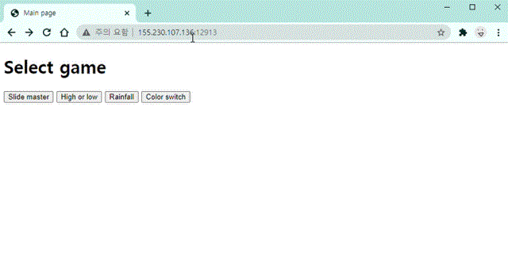

# 김도훈's comment

## 좋았던 점

### 1. 팀원과의 협업 및 분업

프로젝트 기획서를 작성하는 과정에서 텀 프로젝트 기간동안 누가 언제 어떤 작업을 할 지 계획하였습니다.
윤대헌 학생은 멀티쓰레딩과 디바이스 드라이버를 활용한 게임 개발에 집중하였고, 저는 멀티 쓰레딩과 소켓 통신을 활용한 서버-클라이언트 로직 개발에 집중하였습니다. 각자 맡은 역할을 중심으로 코드 작업을 진행하는 동시에, 난관에 봉착했을 때는 서로 도와주면서 원활하고 효율적인 프로젝트 진행이 가능했습니다.

또한, 프로젝트 전반에 git을 통해 코드를 관리하여 버전 관리와 코드 동기화에 수월했습니다. 특히 본 프로젝트는 Sense HAT이 부착된 라즈베리파이4 2기와 개인적으로 구비한 Ubuntu server 라즈베리파이4 1기, 총 3기의 라즈베리파이로 구성되어 이들의 빈번한 코드 동기화가 필수적이었습니다. 

### 2. 계획 및 실천

서버-클라이언트 통신과 웹을 구현하기 위해서 미리 개발 단계를 계획해놓고, 
계획을 따라 한 단계씩 만들어나가는 방식을 통해 개발이 순조롭게 진행 가능했습니다.
역할을 분담한 뒤 제가 구상하고 실천한 계획은 다음과 같습니다.

1. 강의 자료에 있는 Improved multiple client/server 만들어보기
2. 문자 하나 대신 문자열을 송수신하도록 변경하기
3. 단방향 통신 구조를 양방향 통신이 가능하도록 변경하기
4. brainwars 게임 상태 천이 규칙 처리 로직 구현하기
5. 문자열 대신 메시지 구조체를 송수신하도록 변경하기
6. 윤대헌 학생이 개발한 게임들을 로직에 통합하기
7. 웹 서버를 로직에 통합하기

저와 윤대헌 학생 모두 각 단계를 진행하면서 코드의 양이 늘어나면 여러개의 파일로 분리하고, 함수의 단위로 모듈화하여 중복되는 코드의 양을 최소화하고자 하였습니다. 이를 통해 main함수와 server, client의 메인 코드가 읽기 쉬워졌고, 윤대헌 학생이 작성한 게임을 한두번의 함수 호출만으로 클라이언트 로직에 통합할 수 있었습니다. 이는 개발 과정에서 지속적으로 소통하면서 코드의 인터페이스를 서로에게 맞추어 나갔기 때문에 가능했습니다.

<br>

## 어려웠던 점 - 웹 서버 

프로젝트 기획 단계에서 구상한 웹 서비스를 구현하기 위해서는 정적인 웹 페이지 하나만 보여주는 것으로는 부족하였고, 브라우저의 요청에 대한 응답을 처리하는 웹 서버를 만들 필요가 있었습니다. 하지만 강의와 강의자료를 통해서는 해결할 수 없는 문제였기 때문에, 구글링을 통해 [C언어로 구현된 오픈 소스 코드](https://gist.github.com/laobubu/d6d0e9beb934b60b2e552c2d03e1409e)를 활용하여 웹 서버를 만들었습니다. 해당 프로젝트는 코드를 사용하는 사람이 필요에 맞게 GET과 POST의 처리를 정의하는 `route()` 함수만 작성하면 바로 구동할 수 있게 되어있었습니다. 

해당 코드의 전체적인 동작 방식을 자세히 이해하지 않은 채로 사용하다가, 나중에 게임 로직 서버와 웹 서버를 통합하는 과정에서 문제가 생겼습니다. 
웹 브라우저에서 버튼 입력으로 게임을 선택하면 웹 서버 쓰레드에서 선택한 게임의 고유번호를 전역 변수 `game`에 저장하는데,
게임 로직 쓰레드에서 저장된 값이 적용이 되지 않는 문제가 발생하였습니다. 게임 로직 쓰레드와 웹 서버 쓰레드가 `game`이라는 한 전역변수를 참조하는데, 게임 로직 쓰레드에서는 읽기만 하고 웹 서버 쓰레드에서 읽고 쓰기를 합니다. 그래서 하나 전역 변수를 공유하는 것에는 문제가 없을 것이라고 판단했었습니다.

하지만 각각의 쓰레드에서 `game` 변수의 포인터 주소도 확인해보았지만 똑같았고, 값 쓰기가 되지 않는 원인을 찾아내는데 상당히 긴 시간이 소요되었습니다. 원인은 웹 서버가 동작하는 방식에 있었는데, 웹 서버는 브라우저로 부터 요청이 오면 이를 처리하기 위해서 새로운 child process를 `fork()`를 통해 생성합니다. 이를 통해 기존의 parent process는 다른 요청을 계속 처리할 수 있게 하는 것이었습니다.

child process의 `route()` 함수에서 game 변수의 값을 바꾸는 것이므로 당연히 parent process의 `game` 변수에는 영향을 미치지 못했기 때문에, 게임 로직 쓰레드에서도 `game`이 바뀌지 않았던 것입니다. 따라서 process 간의 데이터 전달을 위해 pipe를 사용하여 문제를 해결하였습니다.

```c
void *serve_forever(void *port) {
    ...
    int fd_pipe[2];
    char buffer[32];
    pid_t pid; 
    ...
    // ACCEPT connections
    while (1) {
        ...
            pipe(fd_pipe);
            pid = fork();

            if (pid == 0) { 
                // child process
                respond(slot);
                
                sprintf(buffer, "%d", game);
                write(fd_pipe[1], buffer, 32);

                exit(0);
            }
            else if (pid > 0) { 
                // parent process
                read(fd_pipe[0], buffer, 32);
                game = atoi(buffer);
            }
        }
        ...
    }
}
```

<br>

## 아쉬운 점 - 부족했던 웹에 대한 지식

### 1. 웹 브라우저에서 가끔 동작을 두번해야 실행되는 문제



웹 서버를 게임 로직 서버에 통합하고 난 이후부터 일어나기 시작한 문제입니다.
버튼을 클릭하여 다음 페이지로 넘어가는 동작, F5를 눌러 새로고침하는 동작 등 
웹 브라우저에서 취하는 동작들이 한번의 클릭으로 실행되지 않고 
한번 더 클릭을 해야 실행되는 현상이 불규칙적으로 일어났습니다. 
더블 클릭을 하듯이 클릭을 하면 실행이 잘 되긴 하지만 자연스럽지 않았습니다.
해당 문제의 원인을 찾아 고치기 위해 많은 노력을 하였지만 끝내 해결하지 못했습니다.

### 2. 서버에 동기화된 자동 페이지 넘김 못함

클라이언트와 서버는 정해진 규칙에 따라 각각의 상태가 변하면서 게임이 진행됩니다.
따라서 기존의 계획은 서버 쓰레드에서 전역 변수 state를 변경하면
웹 쓰레드에서 상태 변경을 감지해 다음 페이지로 화면을 전환하는 것이었습니다.
하지만 이 또한 적절한 방법을 찾지 못했습니다.
저희가 구현한 웹 서버는 브라우저로부터 요청이 오면 이에 대해 html로 응답을 하는 것만 있고,
서버 측에서 브라우저로 먼저 html 페이지를 전송하는 것은 할 수 없었기 때문입니다.
궁여지책으로 브라우저에서 자동으로 일정한 간격으로 새로고침하며 새 html을 받아오는 방법을 고려해보았으나
앞의 1번 문제로 자동 새로고침이 정상적으로 실행되지 않았습니다.
따라서 자동 페이지 전환 대신 next 버튼을 눌러 다음 페이지로 넘어가게 구현하였습니다.

### 3. POST 사용 못함

원래는 웹 페이지의 대기화면에서 두명의 유저의 이름을 입력받고 이를 서버에 저장해,
마지막 게임 결과를 웹 페이지에 표시할 때 점수, 승패와 함께 이름을 보여주고자하였습니다.
하지만 웹 서버 코드에서 POST를 사용하는 방법에 대한 이해의 부족으로 브라우저에서 웹 서버로
값을 전달하는 로직의 구현을 성공하지 못했습니다.
